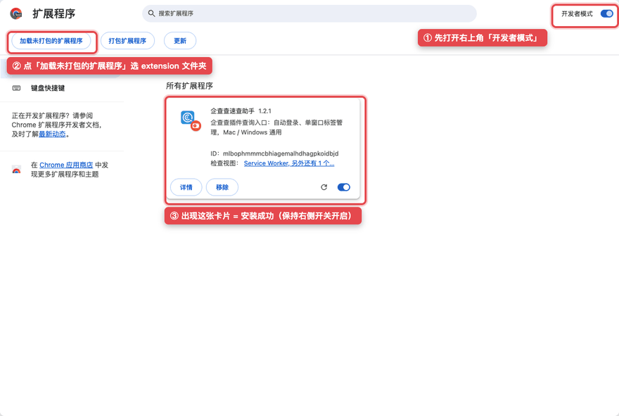
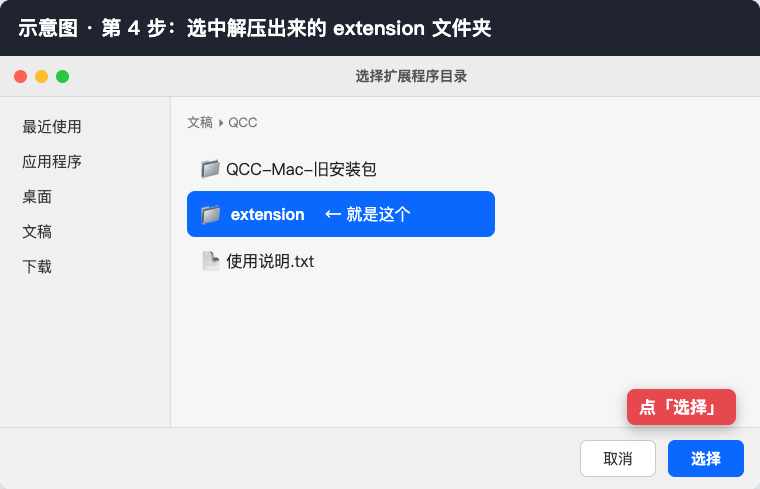
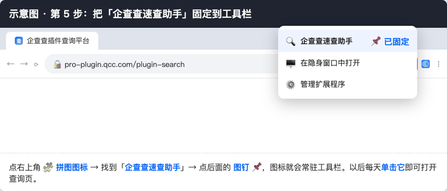
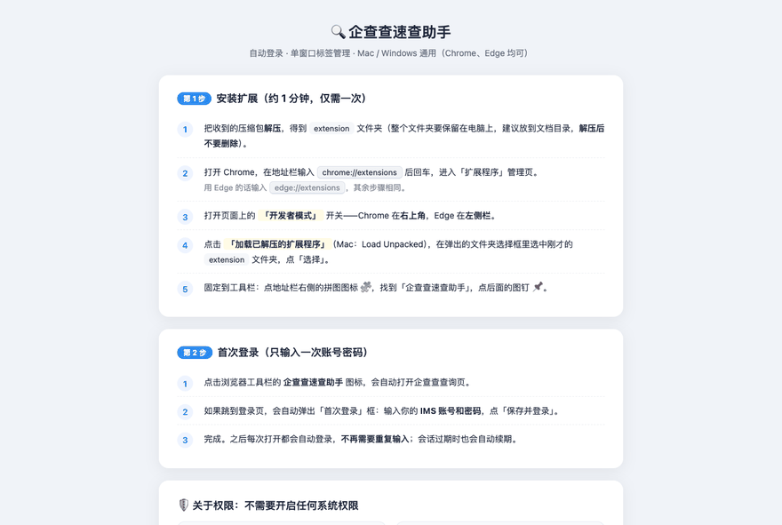
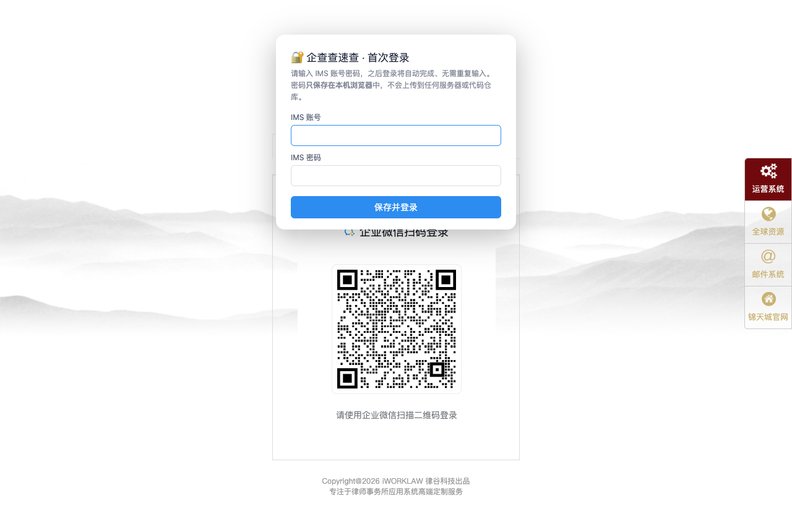

# 企查查速查助手

  

> **适用对象**：锦天城律师事务所（AllBright Law Offices）同事。
> 本扩展是**事务所 IMS 系统里「企查查」的一键直达快速打开方式**（IMS · 企查查插件平台 pro-plugin.qcc.com）。

## 😫 没有它，每次都这样

打开事务所订阅的企查查，你需要：进入 IMS → 找到企查查应用入口 → 点开 → 等待跳转 → 输入账号密码 → 会话过期了还要**从头再来一遍**……步骤多、等待久，还经常"看着正常、一点就失效"。

## 😍 装上它，一键直达

- 🖱️ **一键直达**：单击浏览器工具栏图标，直达企查查查询页
- 🔐 **自动登录**：会话过期时在后台自动换票/重新登录，全程无感
- 🪟 **单窗口**：点击企业、点开详情，都在同一窗口以新标签打开，不再弹出一堆窗口
- 🔒 **密码绝不离开你的电脑**：账号密码只保存在你自己电脑的浏览器本地存储里，**不上传到任何服务器**、不随浏览器账号同步、也不在代码仓库和压缩包中

分发包：[Releases · v1.2.1](https://github.com/Mars-AI-lawyer/QCC/releases/tag/v1.2.1) 下载 `qcc-extension.zip`（私密仓库需有访问权限，没有权限就直接把 zip 文件发给你）。

## 一、安装（Mac / Windows 步骤完全相同，约 1 分钟）

> 以 Chrome 为例；Edge 只是把 `chrome://extensions` 换成 `edge://extensions`，其余完全相同。

**第 1 步**：解压 `qcc-extension.zip`，得到 `extension` 文件夹。
⚠️ 这个文件夹要一直留在电脑上（建议放到「文档」目录），**解压后不要删除**，扩展靠它运行。

**第 2 步**：打开 Chrome，在地址栏输入 `chrome://extensions` 回车，进入「扩展程序」管理页。
**先打开右上角「开发者模式」开关**（Edge 在左侧栏），再点左上角**「加载未打包的扩展程序」**：

**第 3 步**：在弹出的文件夹选择框里，选中解压出来的 `extension` 文件夹，点「选择」：

**第 4 步**：列表里出现「企查查速查助手」卡片就是装好了。最后把它**固定到工具栏**：点地址栏右侧的拼图图标 🧩 → 找到「企查查速查助手」→ 点后面的图钉 📌：

**第 5 步**：安装完成会**自动弹出图文引导页**（下图），以后忘了怎么用随时可以回看：

## 二、首次登录（只输入一次账号密码）

1. 点浏览器工具栏的 **企查查速查助手** 图标 → 自动打开企查查查询页。
2. 若跳到登录页，会自动弹出「首次登录」框：输入你的 **IMS 账号和密码** → 点「保存并登录」：

3. 完成。之后每次打开**自动登录**；会话过期时在后台自动续期，无需重复输入。

## 三、关于权限：不需要开启任何系统权限

- ✅ 唯一要做的：上面第一步的 **「开发者模式 + 加载已解压的扩展程序」**。
  这是 Chrome 对非商店扩展的唯一要求，开关就在扩展管理页里，**不是**系统设置。
- ❌ 不需要：辅助功能、屏幕录制、「自动化」、完全磁盘访问、终端权限……
  如果有软件让你去「系统设置 → 隐私与安全性」授权，那不是本工具，请勿授权。
- 扩展只访问三个网站：`pro-plugin.qcc.com`（企查查插件）、`www.qcc.com`（企业详情）、`ims.allbrightlaw.com`（IMS 登录）。

## 四、密码安全（不会上传 GitHub）

- 账号密码保存在**你自己电脑的浏览器**里（扩展本地存储 `chrome.storage.local`）：
  不上传任何服务器、不随浏览器账号同步、也不在代码仓库中。
- 代码仓库内**不含任何账号密码**，可以放心分享/推送到 GitHub。
- 换电脑、换同事使用：各自解压安装后，各自输入一次各自的 IMS 账号密码即可。
- 修改/清除密码：工具栏图标**右键 → 选项**；连续登录失败 3 次会自动停用已存密码并要求重录。

## 五、单窗口标签管理

- 点击搜索结果里的企业、或在详情页里继续点击，都会在**当前窗口的右侧开新标签**，不再弹出新窗口。
- 请通过**工具栏扩展图标**打开查询页（可在 `chrome://extensions/shortcuts` 设快捷键，如 Alt+Q）；
  从旧的书签/桌面快捷方式打开时行为可能不受扩展控制。

## 六、排障

| 现象 | 处理 |
|---|---|
| 点扩展图标没反应 | 确认 `chrome://extensions` 里「企查查速查助手」已启用；点开「服务工作进程」可看日志 |
| 提示会话已失效、要求手动登录 | 多次自动换票失败（如密码已被修改）：页面手动登录一次，或到「选项」里更新密码 |
| 加载扩展时提示「已被管理员停用」 | 企业管控版 Chrome 禁止未上架扩展，需 IT 放行，或改用个人版 Chrome/Edge |
| 仍弹新窗口 | 检查查询页是否从旧「应用快捷方式」打开；改用扩展图标打开 |

---

## 开发者备忘（Mars）

- 源码：`extension/`（MV3：background service worker + content scripts，登录/换票选择器沿用 v9/v10 实测结果）。
- 打包分发：`zip -rq qcc-extension.zip extension -x "*.DS_Store"`，挂到 GitHub Release（**附件名不能是中文**）。
- 代码更新后：重打包发新 zip → 同事覆盖原 `extension` 文件夹 → 扩展管理页点刷新 ↻（账号密码不丢）。
- 历史：曾有过 Mac Dock App 方案（AppleScript + Node，v7~v3.3），2026-08-31 起统一为扩展方案；
  旧源码在 git 历史中（`f5d1070` 及之前），本机如有残留可删除 `~/Applications/企查查速查.app`。
